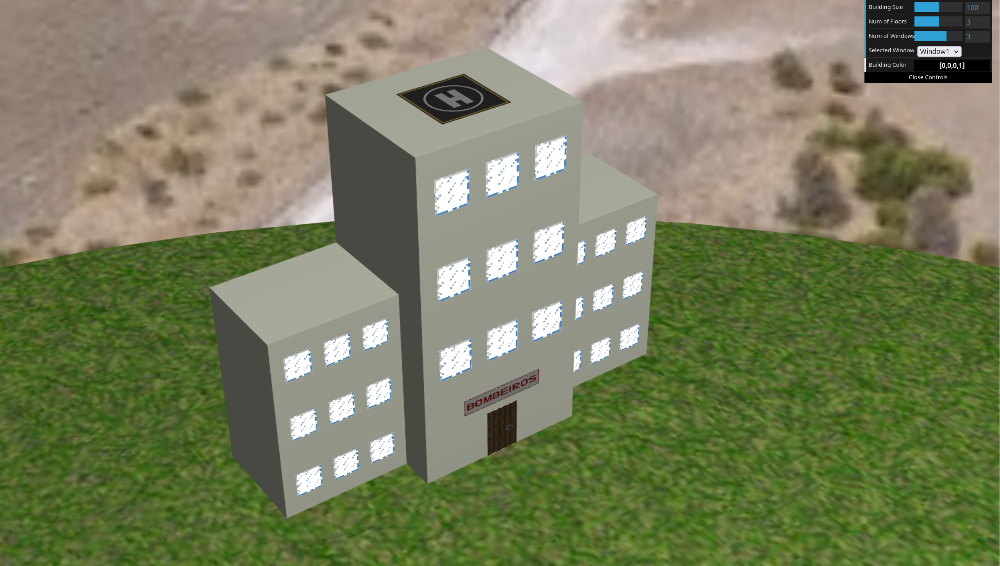
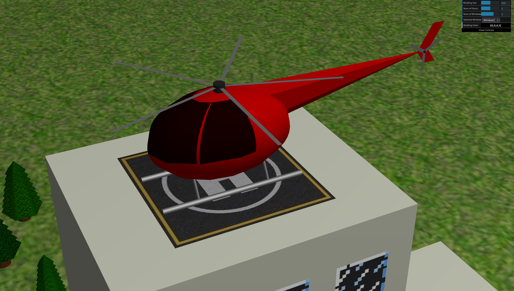

# CG 2024/2025

## Group T13G01

## Project Notes

<figure>
    
    <figcaption>Fig. 1: Screenshot of Sky Sphere step 1.2</figcaption>
</figure>

<figure>
    
    <figcaption>Fig. 2: Screenshot of Building step 2.2</figcaption>
</figure>

<figure>
    
    <figcaption>Fig. 3: Screenshot of Forest step 3.4</figcaption>
</figure>

<figure>
    
    <figcaption>Fig. 4: Screenshot of Helicopter step 4.1</figcaption>
</figure>

<figure>
    
    <figcaption>Fig. 5: Screenshot of Helicopter step 4.3</figcaption>
</figure>

<figure>
    
    <figcaption>Fig. 6: Screenshot of Lake and Fire step 5</figcaption>
</figure>

<figure>
    
    <figcaption>Fig. 6: Screenshot of Fire Ondulation step 6.1</figcaption>
</figure>

