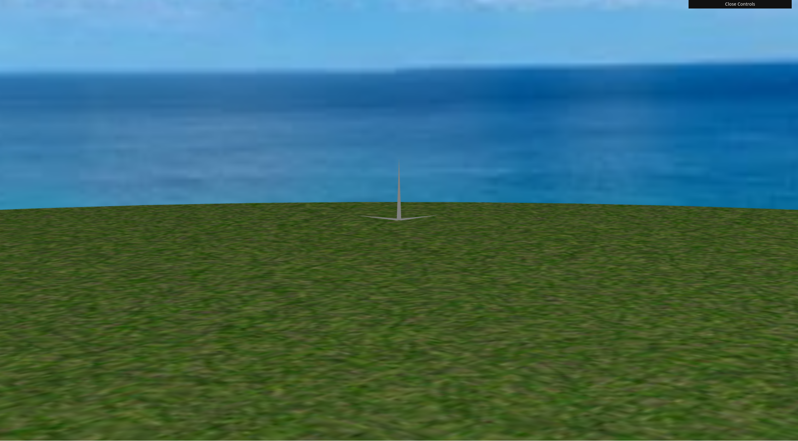

<h1 align="center"> CG 2024/2025 - Final Project</h1>

> **Group T13G01**  
> - Bruno Ricardo Soares Pereira de Sousa Oliveira (202208700)  
> - Rodrigo Albergaria Coelho e Silva (202205188)

<h2>Table of Contents</h2>

- [Controls Overview](#controls-overview)
- [Implemented Functionalities](#implemented-functionalities)
- [Checkpoint List](#checkpoint-list)
  - [Sky Sphere](#sky-sphere)
  - [Building](#building)
  - [Forest](#forest)
  - [Helicopter 1](#helicopter-1)
  - [Helicopter 2](#helicopter-2)
  - [Lake and Fire](#lake-and-fire)
  - [Fire Ondulation](#fire-ondulation)
  - [Additional Development](#additional-development)
- [Developers](#developers)

## Controls Overview

## Implemented Functionalities

- Panorama
- Terrain
- Building
- Forest
- Helicopter
- Lake
- Fire

## Checkpoint List

### Sky Sphere

<figure>
    
    <figcaption>Fig. 1: Screenshot of Sky Sphere step 1.2</figcaption>
</figure>

### Building

<figure>
    
    <figcaption>Fig. 2: Screenshot of Building step 2.2</figcaption>
</figure>

### Forest

<figure>
    
    <figcaption>Fig. 3: Screenshot of Forest step 3.4</figcaption>
</figure>

### Helicopter 1

<figure>
    
    <figcaption>Fig. 4: Screenshot of Helicopter step 4.1</figcaption>
</figure>

### Helicopter 2

<figure>
    
    <figcaption>Fig. 5: Screenshot of Helicopter step 4.3</figcaption>
</figure>

### Lake and Fire

<figure>
    
    <figcaption>Fig. 6: Screenshot of Lake and Fire step 5</figcaption>
</figure>

### Fire Ondulation

<figure>
    
    <figcaption>Fig. 6: Screenshot of Fire Ondulation step 6.1</figcaption>
</figure>

### Additional Development

<figure>
    
    <figcaption>Fig. 6: Screenshot of Additional Development step 7</figcaption>
</figure>

## Developers

| Name                                           | Number    | E-Mail            |
| ---------------------------------------------- | --------- | ----------------- |
| Bruno Ricardo Soares Pereira de Sousa Oliveira | 202208700 | up202208700@up.pt |
| Rodrigo Albergaria Coelho e Silva              | 202205188 | up202205188@up.pt |
