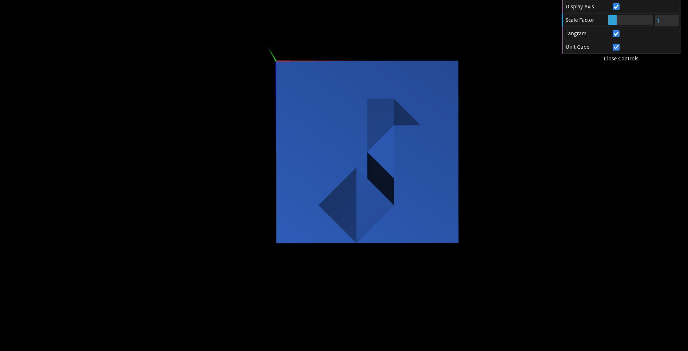
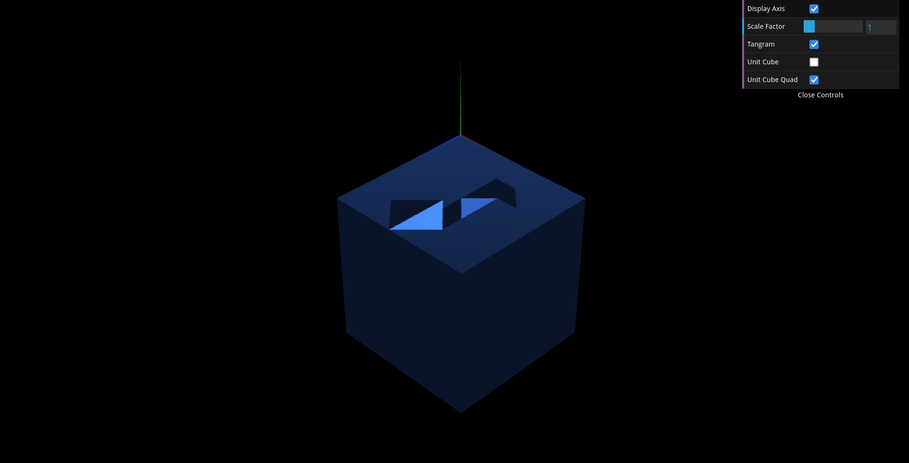

# CG 2024/2025

## Group T13G01

## TP2 Notes

In comparison to last week's exercise, we found this one to be a little trickier, mostly due to the following points:

- Having to calculate each measure manually for the transformations
- In exercise 2, needing to define the transformation matrices also manually, accompanied by having to define the matrices with their transpose.

Other than that, the exercises were relatively simple.

<figure>
    
    <figcaption>Fig. 1: Screenshot of exercise 2.</figcaption>
</figure>
<figure>
    
    <figcaption>Fig. 2: Screenshot of exercise 3.</figcaption>
</figure>
<figure>
    
    <figcaption>Fig. 3: Screenshot of exercise 4.</figcaption>
</figure>