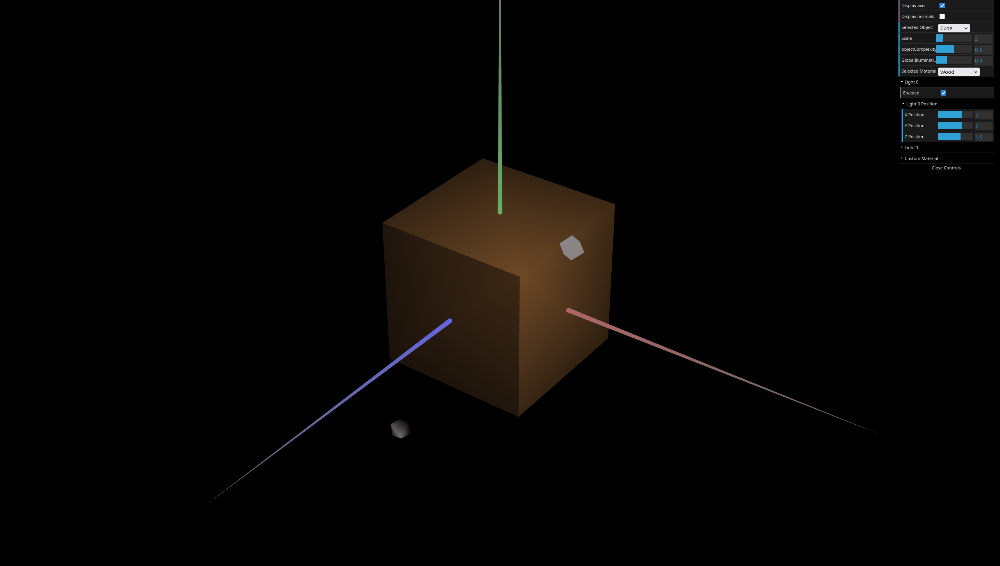
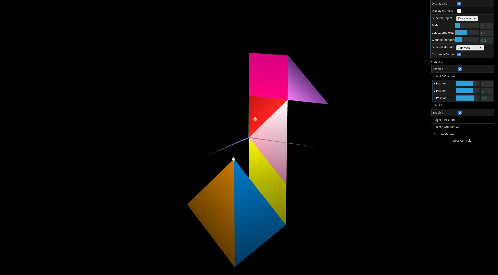
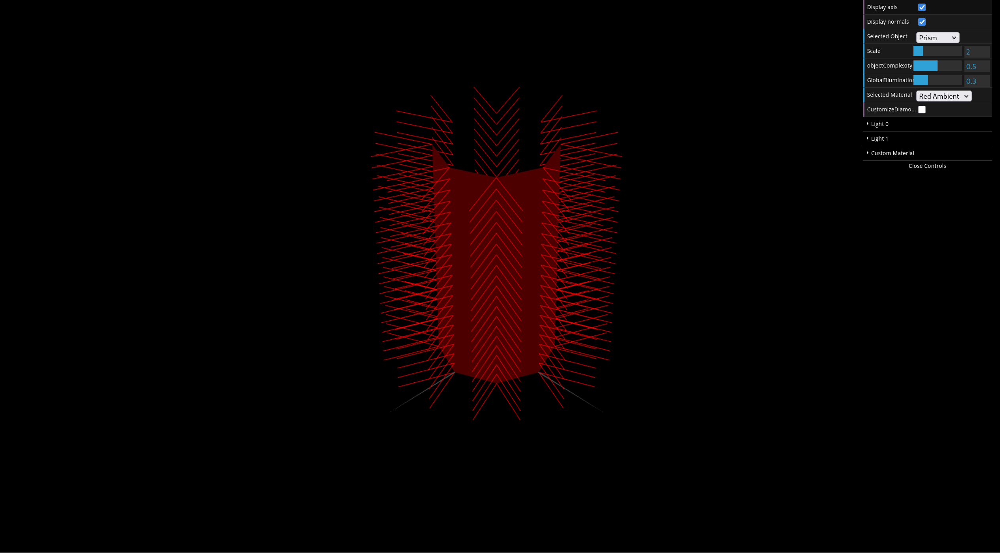
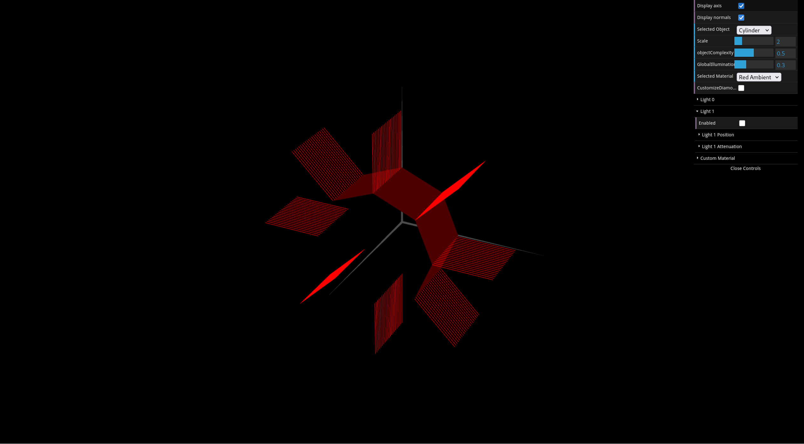

# CG 2024/2025

## Group T13G01

## TP3 Notes

Week 1: So far, we didn't have much trouble doing the exercises of part 1, although we found it harder to adjust the material's colors to the aspect desired in 4. and 5.

Week 2: Everything went smoothly for parts 2 and 3. The only steps that took some more planning were due to calculations for the angles, indices and normals, but, for us, it went considerably better than the previous week.

<figure>
    
    <figcaption>Fig. 1: Screenshot of part 1 exercise 4.</figcaption>
</figure>
<figure>
    
    <figcaption>Fig. 2: Screenshot of part 1 exercise 6.</figcaption>
</figure>
<figure>
    
    <figcaption>Fig. 2: Screenshot of part 1 exercise 6.</figcaption>
</figure>
<figure>
    
    <figcaption>Fig. 2: Screenshot of part 1 exercise 6.</figcaption>
</figure>
