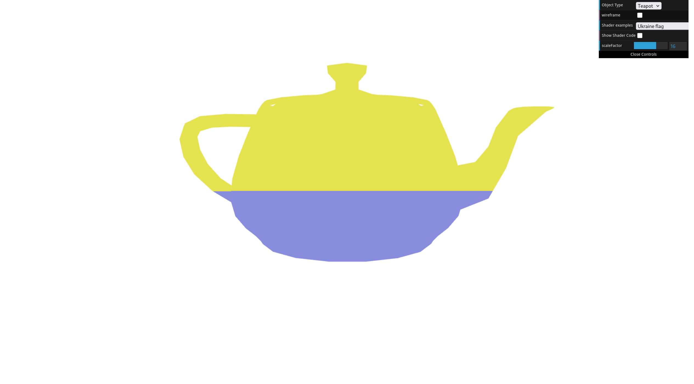
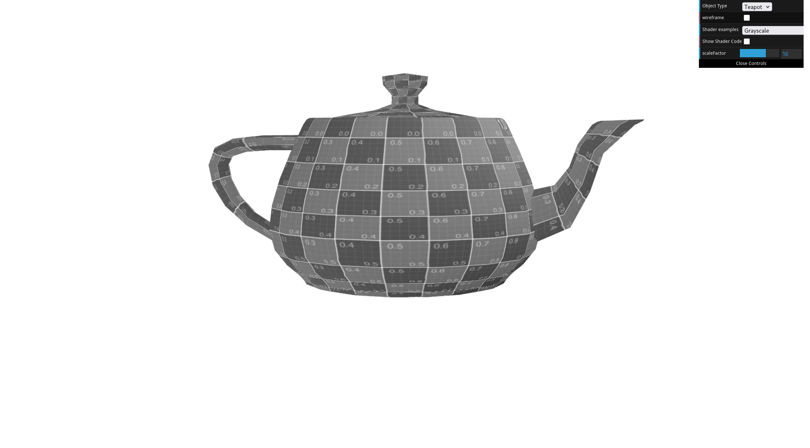
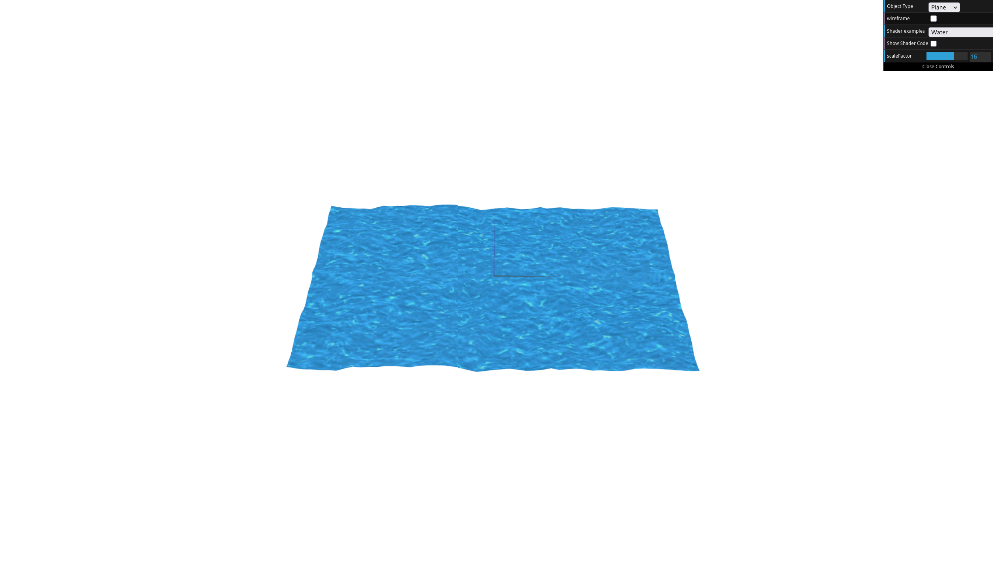

# CG 2024/2025

## Group T13G01

## TP5 Notes

In general, we found the exercises in this class pretty simple and we have no major difficulties to point out. Our biggest difficulty was adjusting the water animation, in exercise 2, since the animation was giving the water a bumpy texture and a choppy movement.

<figure>
    
    <figcaption>Fig. 1: Screenshot of exercise 1 step 1.</figcaption>
</figure>
<figure>
    
    <figcaption>Fig. 2: Screenshot of exercise 1 step 3.</figcaption>
</figure>
<figure>
    
    <figcaption>Fig. 2: Screenshot of exercise 2 step 4.</figcaption>
</figure>

